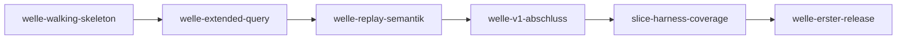

# Roadmap

**Format-Regel:** Die Roadmap ist eine Reihenfolge von **Wellen**,
keine Reihenfolge von Terminen (siehe
Baseline-Regelwerk `modul-06-roadmap.md`).
Termine werden — falls überhaupt — als Konsequenz der Wellen-Schätzung
gezeigt, nicht als Treiber.

---

## Offene Wellen

Regeln dieser Sektion: Baseline-Regelwerk `modul-06-roadmap.md`
§Roadmap-Struktur: fünf Abschnitte — *Offene Wellen* ist **derivativ**: Der
Zustand sind die flachen Welle-Dateien; woran gearbeitet wird, sagt das
`Welle:`-Feld der Slices in `in-progress/`. Ziel, Trigger und
Closure-Kriterien stehen in der Welle-Datei, nicht hier.

- [welle-v1-abschluss](../welle-v1-abschluss.md)
- [welle-erster-release](../welle-erster-release.md)

In Arbeit: nichts (kein Slice in `in-progress/`). Als nächster folgt [`slice-v1-abschluss-einspielen`](../in-progress/slice-v1-abschluss-einspielen.md) (welle-v1-abschluss).

## Nächste Wellen

Regeln dieser Sektion: Baseline-Regelwerk `modul-06-roadmap.md`
§Roadmap-Struktur: fünf Abschnitte, Bullet *Nächste Wellen* — die geordnete
Vorschau: je Zeile Welle, Trigger als beobachtbare Bedingung, wichtigste Slices
und geschätzter Aufwand (S/M/L, kein Termin).

Keine; alle geplanten Wellen haben eine Datei unter *Offene Wellen*.

## Meilensteine

Regeln dieser Sektion: Baseline-Regelwerk `modul-06-roadmap.md`
§Welle ≠ Meilenstein ≠ Release.

| Meilenstein | Welle(n) | Trigger | Status |
|---|---|---|---|
| M1 | welle-walking-skeleton | `SELECT 1;` Record, PostgreSQL stoppen, Replay mit demselben Ergebnis | erreicht — [welle-walking-skeleton-results](../done/welle-walking-skeleton-results.md) |
| M2 | welle-extended-query | Clients mit Standardtreibern (Extended Query) funktionieren mit Host/Port-Umstellung: Abnahmeszenario 7 nachweisbar | erreicht — [welle-extended-query-results](../done/welle-extended-query-results.md) |
| M3 | welle-replay-semantik, welle-v1-abschluss; wellenlos `slice-harness-abdeckung-gate`, `slice-harness-coverage` | Produkt fertig: alle Anforderungen (MUSS und SOLL) umgesetzt, die Abnahmeszenarien 1 bis 10 und 12 bis 17 nachweisbar | offen |
| M4 | welle-erster-release | erster Release veröffentlicht, Abnahmeszenario 11 (Homebrew) nachgewiesen | offen |

## Abhängigkeitsgraph

Regeln dieser Sektion: Baseline-Regelwerk `modul-06-roadmap.md`
§Roadmap-Struktur: fünf Abschnitte, Bullet *Nächste Wellen* — die Abhängigkeit
steht als beobachtbare Bedingung in der `Trigger`-Spalte **und** als gerichtete
Kante hier; eine Welle, die ohne fertige Vorgängerin nicht starten kann, ist
eine Phantom-Welle.

## Abgeschlossene Wellen

Regeln dieser Sektion: Baseline-Regelwerk `modul-06-roadmap.md`
§Roadmap-Struktur: fünf Abschnitte.

| Welle | Abschluss | Closure-Notiz |
|---|---|---|
| welle-walking-skeleton | 2026-10-04 | [welle-walking-skeleton-results](../done/welle-walking-skeleton-results.md) |
| welle-extended-query | 2026-10-05 | [welle-extended-query-results](../done/welle-extended-query-results.md) |
| welle-replay-semantik | 2026-10-06 | [welle-replay-semantik-results](../done/welle-replay-semantik-results.md) |

## Historische Trigger-Verschiebungen

Regeln dieser Sektion: Baseline-Regelwerk `modul-06-roadmap.md`
§Roadmap-Struktur: fünf Abschnitte, Bullet *Historische Trigger-Verschiebungen*
— das Drift-Log: jede Umplanung mit Datum, Änderung, Grund. Leer heißt starre
Roadmap, jede Zeile voll heißt treibende.

| Datum | Was wurde geändert? | Warum? |
|---|---|---|
| 2026-10-03 | welle-erster-release angelegt; Abnahmeszenario 11 (Homebrew) wandert von M3 nach M4 | Die Homebrew-Formel entsteht erst bei einem veröffentlichten, stabilen Release; M3 und der erste Release bildeten einen Zirkel |
| 2026-10-03 | welle-extended-query vor welle-replay-semantik gezogen; Start-Trigger von welle-replay-semantik von „welle-walking-skeleton done“ auf „welle-extended-query done“ geändert; Meilensteine M2 und M3 neu zugeschnitten | Extended Query gehört zu v1: verbreitete Treiber nutzen es standardmäßig, ohne es genügt die Umstellung von Host und Port nicht |
| 2026-10-03 | welle-v1-abschluss um `slice-v1-abschluss-tls-client` und `slice-v1-abschluss-antwortvergleich` erweitert; M3 umfasst die Abnahmeszenarien 12 bis 16 | Neue SOLL-Anforderungen LH-FA-23 (TLS zum Client) und LH-FA-24 (Antwortvergleich) aus dem Bedarf eines E2E-Einsatzes |
| 2026-10-04 | welle-v1-abschluss um `slice-v1-abschluss-anmeldung` erweitert | Der Record-Modus vermittelt im Walking Skeleton keine Passwort-Anmeldung; LH-FA-05.b verlangt sie |
| 2026-10-05 | welle-extended-query um `slice-extended-query-lebendpruefung` erweitert; M2 schließt erst danach | Validierung von `slice-extended-query-replay`: Die Lebendprüfung von Connection-Pools (`-- ping` nach Leerlauf) macht das strenge Replay zeitabhängig, und die Zusage „nur Host und Port“ aus LH-FA-18 hält für die häufigste Einsatzform nicht; der Nutzer hat entschieden, solche Anfragen zu tolerieren |
| 2026-10-05 | welle-v1-abschluss um `slice-v1-abschluss-postgres-versionen` erweitert | Die Validierung von `slice-extended-query-replay` und [ADR-0031](../../adr/0031-lebendpruefungen-im-replay.md) machen die Serverversion relevant: Das Replay entscheidet selbst, was PostgreSQL als leere Anfrage behandelt, und das hängt am Scanner des Servers; die Spezifikation nennt keine Version, getestet wird nur gegen PostgreSQL 17. Der Nutzer hat entschieden, die Hauptversionen der letzten fünf Jahre zu unterstützen |
| 2026-10-05 | `slice-v1-abschluss-postgres-versionen` startet vor dem Welle-Trigger von welle-v1-abschluss, sobald `slice-extended-query-lebendpruefung` done ist | Entscheidung des Nutzers: Die Lebendprüfung erkennt Leerraum jetzt abhängig von der Serverversion, und die Zusage über die unterstützten Versionen soll nicht bis nach welle-replay-semantik ungeprüft bleiben |
| 2026-10-05 | `slice-harness-lint` und `slice-harness-coverage` (wellenlos) angelegt; sie starten nach `slice-replay-semantik-fehlerreplay` und vor dem nächsten großen Slice, in dieser Reihenfolge (WIP-Limit 1) | Entscheidung des Nutzers: SOLID-naher Lint und eine Schwelle für die Testabdeckung vor dem nächsten großen Slice |
| 2026-10-06 | `slice-lastenheft-pruefbarkeit` und vier Umstellungs-Slices (`slice-harness-blackbox-kern`, `slice-harness-blackbox-driven`, `slice-harness-blackbox-pgwire`, `slice-harness-blackbox-einstieg`) wellenlos angelegt; Reihenfolge vor dem nächsten großen Slice: Lastenheft, `slice-harness-lint`, die vier Umstellungs-Slices, `slice-harness-coverage` | Entscheidung des Nutzers vom 2026-10-05: Tests werden auf Black-Box-Pakete umgestellt (bis dahin `testpackage` gestuft), die Profil-Schwellen des Vorbilds gelten, und das Lastenheft bekommt eine Qualitätsanforderung an die Prüfbarkeit des Quellcodes |
| 2026-10-06 | M3 um Abnahmeszenario 17 (Prüfbarkeit des Quellcodes) erweitert; es entsteht mit `slice-lastenheft-pruefbarkeit` und wird mit `slice-harness-coverage` nachweisbar, sodass die wellenlose Reihe von Lastenheft bis Coverage vor M3 liegt | Entscheidung des Nutzers vom 2026-10-06: die neue Qualitätsanforderung hat Priorität MUSS; das Team hat ein eigenes Abnahmeszenario entschieden (alle drei Prüfungen grün, jede nachweislich rot) |
| 2026-10-06 | `slice-harness-mutation` (wellenlos) angelegt; die wellenlose Reihe endet nach `slice-harness-coverage` mit ihm | Entscheidung des Nutzers vom 2026-10-06 bei der Closure von welle-replay-semantik: `BEO-REPO/zusage-im-kommentar-weiter-als-pruefung` und `BEO-REPO/negativtests-fehlen-bei-neuem-vertrag` sind als Prosa ausgeschöpft und bekommen ein Mutations-Gate als Sensor; M3 hängt nicht an ihm |
| 2026-10-06 | `slice-harness-abdeckung-gate` (wellenlos) angelegt; Reihenfolge der wellenlosen Reihe nach dem Lastenheft: `slice-harness-lint`, die vier Umstellungs-Slices, `slice-harness-abdeckung-gate`, `slice-harness-coverage`, `slice-harness-mutation` | Entscheidung des Nutzers vom 2026-10-06: Der Nachweis von LH-QA-07 in den Abdeckungstabellen nach [ADR-0033](../../adr/0033-gate-nachweise-in-der-abdeckung.md) braucht eine Erweiterung des Abdeckungs-Skripts in einem eigenen Slice; er steht nach der Black-Box-Umstellung, weil Teil 3 erst gilt, wenn `testpackage` überall scharf ist, und vor Coverage, das Teil 2 deklariert |
| 2026-10-06 | `slice-harness-vertraege-spezifikation` (wellenlos) angelegt; er steht in der wellenlosen Reihe nach `slice-lastenheft-pruefbarkeit` und vor `slice-harness-lint` | Antwort des Kurs-Repos ai-harness-course auf den Change Request „Spezifikations-Ort für Verträge der Harness-Werkzeuge“: Der Ort ist die Spezifikation; der Slice legt den Abschnitt an und verlegt die Verträge von `kopf-check` und `abdeckung` dorthin, bevor Lint, Umstellung, Abdeckungs-Erweiterung, Coverage und Mutation ihre Randformen dort entscheiden |
| 2026-10-06 | `slice-harness-lint` von `in-progress/` zurück nach `next/`; `slice-harness-lint-werkzeug`, `slice-lint-bestand-kern-driven` und `slice-lint-bestand-driving` (wellenlos) angelegt; Reihenfolge der wellenlosen Reihe nach dem Lastenheft: `slice-harness-lint-werkzeug`, `slice-harness-blackbox-kern`, `slice-harness-blackbox-driven`, `slice-harness-blackbox-pgwire`, `slice-harness-blackbox-einstieg`, `slice-lint-bestand-kern-driven`, `slice-lint-bestand-driving`, `slice-harness-lint`, `slice-harness-abdeckung-gate`, `slice-harness-coverage`, `slice-harness-mutation` | Messung des Bestands in [ADR-0034](../../adr/0034-lint-gate-mit-solid-nahem-profil.md): 96 Befunde nach den dauerhaften Ausnahmen, 25 davon im Produkt-Code in allen Schichten; Entscheidung des Nutzers vom 2026-10-06: Bereinigung vor dem Gate, ohne Stufen. Das Werkzeug `make lint` kommt vorab, damit jeder Bereinigungs-Slice misst; die Umstellungs-Slices beheben auch die übrigen Befunde ihrer Testdateien, die Bereinigungs-Slices den Produkt-Code; das Gate folgt zuletzt |
| 2026-10-06 | `slice-harness-upgrade-v6-16` (wellenlos) angelegt; er steht in der wellenlosen Reihe nach `slice-harness-lint-werkzeug` und vor `slice-harness-blackbox-kern`, die übrige Reihe bleibt unverändert | Entscheidung des Nutzers vom 2026-10-06: d-check v0.82.0 und Regelwerk v6.16.0 des Kurs-Repos ai-harness-course sind erschienen; beide werden in einem Slice nachgezogen und gegen die verkörperten Regeln abgeglichen, bevor die Umstellungs-Slices ihre Randformen gegen den Stand entscheiden |
| 2026-10-06 | `slice-harness-gate-index-werkzeug-teil` (wellenlos) angelegt; er steht außerhalb der Reihe und startet, wenn ein Lauf von ai-harness-init einen Teil des Gate-Index unter `harness/mk/` schreibt | Befund des Abgleichs v6.13.0 → v6.16.0 in `slice-harness-upgrade-v6-16`: Der neue Stand legt die Targets der Werkzeug-Fragmente in einen Teil des Werkzeugs; bis das Werkzeug ihn schreibt, führt `harness/README.md` sie |
| 2026-10-07 | `slice-harness-commit-struktur-id` und `slice-harness-integration-wait` (wellenlos) angelegt; sie stehen in der wellenlosen Reihe nach `slice-harness-lint` und vor `slice-harness-abdeckung-gate`, in dieser Reihenfolge; das Risiko V-88 geht von `slice-v1-abschluss-betrieb` an `slice-harness-integration-wait` | Entscheidung des Nutzers vom 2026-10-07: `BEO-REPO/commit-nennt-struktur-kennung` erreicht mit dem Nachtrag von F-336 3× und bekommt einen Sensor im Commit-Träger; das doppelte `Wait` im Integrations-Testgeschirr (V-88) lässt einen roten Lauf bis zum Zeitlimit hängen und wird vor den Slices behoben, die weitere Tests über dieselben Helfer schreiben |
| 2026-10-07 | `slice-tests-ueberlebende-mutanten` (wellenlos) angelegt; er steht in der wellenlosen Reihe nach `slice-harness-coverage` und vor `slice-harness-mutation` | Entscheidung des Nutzers vom 2026-10-07 nach Review F-459 und F-461 zu `slice-lint-bestand-kern-driven`: Die bekannten überlebenden Mutanten, die das Verhalten ändern, brauchen eine Adresse, die sie annimmt, und das Mutations-Gate soll nicht mit bekannten Lücken starten; nach Coverage, weil jener Slice M3 abschließt und dieser zu keinem Abnahmeszenario beiträgt |
| 2026-10-07 | `slice-harness-meldungskatalog-gate` (wellenlos) angelegt; er steht in der wellenlosen Reihe nach `slice-harness-integration-wait` und vor `slice-harness-abdeckung-gate`; das Gate für Code-Tabelle und Katalog verlässt §6 von welle-v1-abschluss und §1 von `slice-v1-abschluss-container` | Entscheidung des Nutzers vom 2026-10-07 im Audit nach `AGENTS.md` §3.13 (Fund 1): Die Folgepflicht aus [ADR-0011](../../adr/0011-meldungscodes-praefix-pgr.md) hatte keine Slice-Kennung; das Gate steht vor den Slices von welle-v1-abschluss, die neue Codes einführen |
| 2026-10-07 | Start von `slice-v1-abschluss-postgres-versionen` von „`slice-extended-query-lebendpruefung` done, vor dem Welle-Trigger“ auf „`slice-v1-abschluss-anmeldung` in `done/`“ geändert; die Versionsmatrix fährt auch die Anmeldung mit SCRAM-SHA-256 | Entscheidung des Nutzers vom 2026-10-07 im Audit nach `AGENTS.md` §3.13 (Fund 3): Die Anmeldung je PostgreSQL-Version war in `slice-v1-abschluss-postgres-versionen` an `slice-v1-abschluss-anmeldung` verwiesen, dessen Plan sie nicht führte |
| 2026-10-07 | `slice-tests-ueberlebende-mutanten-driving` (wellenlos) angelegt; er steht in der wellenlosen Reihe direkt nach `slice-tests-ueberlebende-mutanten` und vor `slice-harness-mutation`, dessen Start jetzt beide Sammel-Slices in `done/` verlangt | Sammelregel von `slice-tests-ueberlebende-mutanten` nach Entscheidung des Nutzers vom 2026-10-07: Die sieben grünen, verhaltensändernden Mutanten aus `slice-lint-bestand-driving` (Review F-466 bis F-469, Verifikation V-93 bis V-95) liegen im PGWire-Adapter und im Bootstrap, für jenen Slice eine dritte Schicht; der Planner schneidet einen zweiten Slice ab, damit das Mutations-Gate nicht mit bekannten Lücken startet |
| 2026-10-08 | Wellen vor Harness, Entscheidung des Nutzers 2026-10-08: zuerst die Slices von welle-v1-abschluss, dann die von welle-erster-release, in der Reihenfolge in §5 der beiden Welle-Pläne; die Slices beider Wellen gehen nach `next/`. `slice-harness-commit-struktur-id` geht von `in-progress/` zurück nach `open/` und steht nach den Wellen an erster Stelle der Harness-Reihe, danach `slice-harness-abdeckung-gate`, `slice-harness-coverage`, `slice-tests-ueberlebende-mutanten`, `slice-tests-ueberlebende-mutanten-driving`, `slice-harness-mutation`. `slice-harness-integration-wait` steht direkt vor `slice-v1-abschluss-betrieb`, `slice-harness-meldungskatalog-gate` direkt vor `slice-v1-abschluss-container`. Abnahmeszenario 17 und damit M3 werden erst nach welle-erster-release erreicht | Entscheidung des Nutzers vom 2026-10-08 („zuerst die produktiven Wellen und Slices“). Die zwei Harness-Slices in der Wellen-Reihe sind Entscheidung des Nutzers vom 2026-10-08: §1 von `slice-v1-abschluss-betrieb` schreibt seine Tests über die Helfer, die `slice-harness-integration-wait` umbaut, und §1 von `slice-v1-abschluss-container` nennt das Gate als vorher geliefert |
| 2026-10-08 | `slice-v1-abschluss-betrieb` in drei aufgegangen: `slice-v1-abschluss-herunterfahren`, `slice-v1-abschluss-konfiguration`, `slice-v1-abschluss-schreiben` (welle-v1-abschluss, Reihenfolge `slice-harness-integration-wait`, Herunterfahren, Konfiguration, Schreiben, Einspielen); `slice-v1-abschluss-betrieb` geht ohne Lieferung nach `done/` | Entscheidung des Nutzers vom 2026-10-08 nach F-345: DoD-Punkt 1 passte nicht in eine Review-Sitzung, §3 berührte vier Schichten; jeder der drei hat höchstens drei Liefer-Punkte und zwei Schichten |
| 2026-10-08 | `slice-harness-abdeckung-gate` und `slice-harness-coverage` zwischen welle-v1-abschluss und welle-erster-release gezogen; Start-Trigger von welle-erster-release um „`slice-harness-coverage` in `done/`“ ergänzt; M3 vor M4 | Entscheidung des Nutzers vom 2026-10-08: Mit der Reihenfolge Wellen vor Harness käme Abnahmeszenario 17 und damit M3 erst nach dem ersten Release |
| 2026-10-08 | `slice-harness-lint-warten-ohne-frist` (wellenlos) angelegt; er steht in der Harness-Reihe nach `slice-tests-ueberlebende-mutanten-driving` und vor `slice-harness-mutation`, dessen Start ihn jetzt in `done/` verlangt | Entscheidung des Nutzers vom 2026-10-08 bei der Closure von `slice-v1-abschluss-herunterfahren`: `BEO-REPO/roter-lauf-haengt-bis-zum-zeitlimit` erreicht 3× (F-485, erster Anlauf zu H4) und bekommt eine Prüfung in `make lint`; nach den Sammel-Slices, weil das Lint-Gate keinen Bestand ausnehmen darf und `slice-tests-ueberlebende-mutanten-driving` die Frist im PGWire-Adapter und im Bootstrap schon setzt; vor dem Mutations-Gate, damit dessen Randform *Laufzeit* keinen Test mehr vorfindet, der ohne Frist wartet |
| 2026-10-08 | `slice-v1-abschluss-konfiguration` geschnitten: Er bleibt in `in-progress/` als Leser für Kommandozeile und Umgebung mit der Gegenprobe des Architektur-Gates; die Konfigurationsdatei ist in `slice-v1-abschluss-konfigurationsdatei` (welle-v1-abschluss, `next/`) aufgegangen. Reihenfolge in §5 von welle-v1-abschluss: Konfiguration, Konfigurationsdatei, Schreiben, Einspielen; `slice-v1-abschluss-schreiben` und `slice-v1-abschluss-einspielen` setzen die Konfigurationsdatei voraus | Vorab benannte Rückführung *zu groß* in §4 von `slice-v1-abschluss-konfiguration`, eingetreten am 2026-10-08: Der Implementer schätzte die Datei-Hälfte auf 900 bis 1300 Zeilen, nicht in einer Review-Sitzung prüfbar, und gab zwölf Randformen der Datei an den Architect zurück; Schnitt nach Auftrag des Nutzers ohne Rückführung nach `next/`, weil der Rest abgegeben wird |
| 2026-10-09 | `slice-v1-abschluss-konfigurationsdatei` geschnitten: Er bleibt als *Datei* (Wahl und Laden der Datei, Priorität über drei Quellen, `config show` mit Hilfe, Konstanten, dazu die Tests der Vorgaben des Architect vom 2026-10-09); benannte Verbindungen und Platzhalter sind in `slice-v1-abschluss-verbindungen-platzhalter` (welle-v1-abschluss, `next/`) aufgegangen. Reihenfolge in §5 von welle-v1-abschluss: Konfigurationsdatei, Verbindungen und Platzhalter, Schreiben, Einspielen; die übrigen Schritte rücken um eins nach; `slice-v1-abschluss-einspielen` setzt den neuen Slice voraus (`--upstream` mit Verbindungsname bei `play`) | Vorab benannte Rückführung *zu groß* in §4 von `slice-v1-abschluss-konfigurationsdatei`, eingetreten am 2026-10-09: Der Diff von DoD-Punkt 1 und 2 allein umfasst rund 1250 Zeilen; Rückführung `in-progress` → `next` formal über `next/` nach Entscheidung des Nutzers vom 2026-10-09 zu V-117 |
| 2026-10-09 | `slice-v1-abschluss-verbindungen-platzhalter` vor dem ersten Code-Commit geschnitten: Er bleibt als *Laden der Verbindungen* (Zerlegung und Form der URL mit Platzhaltern, `sslmode`, `PGR-E2006` auch bei `config show`, `$$` und `${` außerhalb einer URL, Schlüssel `upstream` gegen die Namen, Name ohne `:` und `@`); das *Benutzen der Verbindung* ist in `slice-v1-abschluss-upstream-verbinden` (welle-v1-abschluss, `next/`) aufgegangen. Reihenfolge in §5 von welle-v1-abschluss: Laden, Benutzen, Schreiben, Einspielen; die übrigen Schritte rücken um eins nach; `slice-v1-abschluss-einspielen` setzt den neuen Slice voraus und übernimmt die Wirkung bei `play` von ihm | Vorab benannte Rückführung *zu groß* in §4 von `slice-v1-abschluss-verbindungen-platzhalter`, eingetreten am 2026-10-09 vor dem Code: Der Architect schätzte den Diff auf 1050 bis 1300 Zeilen, so groß wie der Geber, als er zurückging; Schnitt nach der Phase nach Entscheidung des Nutzers vom 2026-10-09 |
| 2026-10-09 | `slice-erster-release-veroeffentlichung` vor dem Start geschnitten: Er behält die Pipeline (Tag und Versionsdatei, Binaries mit `SHA256SUMS` und GitHub-Release, Image mit gleichem Index-Digest, `:latest` nur bei stabilen Tags), dazu Wiederanlauf und Fehlertabelle, belegt mit einem Probe-Tag; Scan, Freshness-Audit, Freigabe-Checkliste und der erste echte Tag sind in `slice-erster-release-freigabe` (welle-erster-release, `next/`) aufgegangen. Reihenfolge in §5 von welle-erster-release: Veröffentlichung, Freigabe, Homebrew-Nachweis; `slice-erster-release-homebrew-nachweis` setzt die Freigabe voraus | Entscheidung des Nutzers vom 2026-10-09: Mit seinen sieben Entscheidungen zum Release trug der Slice sechs Liefer-Punkte, die Grenze ist drei |
