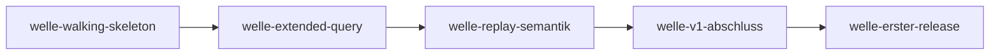

# Roadmap

**Format-Regel:** Die Roadmap ist eine Reihenfolge von **Wellen**,
keine Reihenfolge von Terminen (siehe
Baseline-Regelwerk `modul-06-roadmap.md`).
Termine werden — falls überhaupt — als Konsequenz der Wellen-Schätzung
gezeigt, nicht als Treiber.

---

## Offene Wellen

Regeln dieser Sektion: Baseline-Regelwerk `modul-06-roadmap.md`
§Roadmap-Struktur: fünf Abschnitte — *Offene Wellen* ist **derivativ**: Der
Zustand sind die flachen Welle-Dateien; woran gearbeitet wird, sagt das
`Welle:`-Feld der Slices in `in-progress/`. Ziel, Trigger und
Closure-Kriterien stehen in der Welle-Datei, nicht hier.

- [welle-replay-semantik](../welle-replay-semantik.md)
- [welle-v1-abschluss](../welle-v1-abschluss.md)
- [welle-erster-release](../welle-erster-release.md)

In Arbeit: nichts (kein Slice in `in-progress/`).

## Nächste Wellen

Regeln dieser Sektion: Baseline-Regelwerk `modul-06-roadmap.md`
§Roadmap-Struktur: fünf Abschnitte, Bullet *Nächste Wellen* — die geordnete
Vorschau: je Zeile Welle, Trigger als beobachtbare Bedingung, wichtigste Slices
und geschätzter Aufwand (S/M/L, kein Termin).

Keine; alle geplanten Wellen haben eine Datei unter *Offene Wellen*.

## Meilensteine

Regeln dieser Sektion: Baseline-Regelwerk `modul-06-roadmap.md`
§Welle ≠ Meilenstein ≠ Release.

| Meilenstein | Welle(n) | Trigger | Status |
|---|---|---|---|
| M1 | welle-walking-skeleton | `SELECT 1;` Record, PostgreSQL stoppen, Replay mit demselben Ergebnis | erreicht — [welle-walking-skeleton-results](../done/welle-walking-skeleton-results.md) |
| M2 | welle-extended-query | Clients mit Standardtreibern (Extended Query) funktionieren mit Host/Port-Umstellung: Abnahmeszenario 7 nachweisbar | erreicht — [welle-extended-query-results](../done/welle-extended-query-results.md) |
| M3 | welle-replay-semantik, welle-v1-abschluss | Produkt fertig: alle Anforderungen (MUSS und SOLL) umgesetzt, die Abnahmeszenarien 1 bis 10 und 12 bis 16 nachweisbar | offen |
| M4 | welle-erster-release | erster Release veröffentlicht, Abnahmeszenario 11 (Homebrew) nachgewiesen | offen |

## Abhängigkeitsgraph

Regeln dieser Sektion: Baseline-Regelwerk `modul-06-roadmap.md`
§Roadmap-Struktur: fünf Abschnitte, Bullet *Nächste Wellen* — die Abhängigkeit
steht als beobachtbare Bedingung in der `Trigger`-Spalte **und** als gerichtete
Kante hier; eine Welle, die ohne fertige Vorgängerin nicht starten kann, ist
eine Phantom-Welle.

## Abgeschlossene Wellen

Regeln dieser Sektion: Baseline-Regelwerk `modul-06-roadmap.md`
§Roadmap-Struktur: fünf Abschnitte.

| Welle | Abschluss | Closure-Notiz |
|---|---|---|
| welle-walking-skeleton | 2026-10-04 | [welle-walking-skeleton-results](../done/welle-walking-skeleton-results.md) |
| welle-extended-query | 2026-10-05 | [welle-extended-query-results](../done/welle-extended-query-results.md) |

## Historische Trigger-Verschiebungen

Regeln dieser Sektion: Baseline-Regelwerk `modul-06-roadmap.md`
§Roadmap-Struktur: fünf Abschnitte, Bullet *Historische Trigger-Verschiebungen*
— das Drift-Log: jede Umplanung mit Datum, Änderung, Grund. Leer heißt starre
Roadmap, jede Zeile voll heißt treibende.

| Datum | Was wurde geändert? | Warum? |
|---|---|---|
| 2026-10-03 | welle-erster-release angelegt; Abnahmeszenario 11 (Homebrew) wandert von M3 nach M4 | Die Homebrew-Formel entsteht erst bei einem veröffentlichten, stabilen Release; M3 und der erste Release bildeten einen Zirkel |
| 2026-10-03 | welle-extended-query vor welle-replay-semantik gezogen; Start-Trigger von welle-replay-semantik von „welle-walking-skeleton done“ auf „welle-extended-query done“ geändert; Meilensteine M2 und M3 neu zugeschnitten | Extended Query gehört zu v1: verbreitete Treiber nutzen es standardmäßig, ohne es genügt die Umstellung von Host und Port nicht |
| 2026-10-03 | welle-v1-abschluss um `slice-v1-abschluss-tls-client` und `slice-v1-abschluss-antwortvergleich` erweitert; M3 umfasst die Abnahmeszenarien 12 bis 16 | Neue SOLL-Anforderungen LH-FA-23 (TLS zum Client) und LH-FA-24 (Antwortvergleich) aus dem Bedarf eines E2E-Einsatzes |
| 2026-10-04 | welle-v1-abschluss um `slice-v1-abschluss-anmeldung` erweitert | Der Record-Modus vermittelt im Walking Skeleton keine Passwort-Anmeldung; LH-FA-05.b verlangt sie |
| 2026-10-05 | welle-extended-query um `slice-extended-query-lebendpruefung` erweitert; M2 schließt erst danach | Validierung von `slice-extended-query-replay`: Die Lebendprüfung von Connection-Pools (`-- ping` nach Leerlauf) macht das strenge Replay zeitabhängig, und die Zusage „nur Host und Port“ aus LH-FA-18 hält für die häufigste Einsatzform nicht; der Nutzer hat entschieden, solche Anfragen zu tolerieren |
| 2026-10-05 | welle-v1-abschluss um `slice-v1-abschluss-postgres-versionen` erweitert | Die Validierung von `slice-extended-query-replay` und [ADR-0031](../../adr/0031-lebendpruefungen-im-replay.md) machen die Serverversion relevant: Das Replay entscheidet selbst, was PostgreSQL als leere Anfrage behandelt, und das hängt am Scanner des Servers; die Spezifikation nennt keine Version, getestet wird nur gegen PostgreSQL 17. Der Nutzer hat entschieden, die Hauptversionen der letzten fünf Jahre zu unterstützen |
| 2026-10-05 | `slice-v1-abschluss-postgres-versionen` startet vor dem Welle-Trigger von welle-v1-abschluss, sobald `slice-extended-query-lebendpruefung` done ist | Entscheidung des Nutzers: Die Lebendprüfung erkennt Leerraum jetzt abhängig von der Serverversion, und die Zusage über die unterstützten Versionen soll nicht bis nach welle-replay-semantik ungeprüft bleiben |
