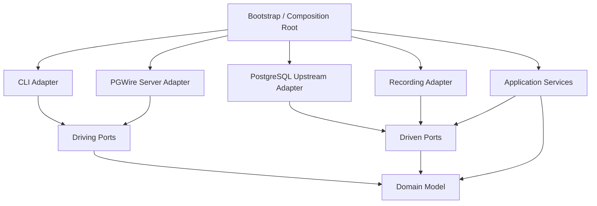
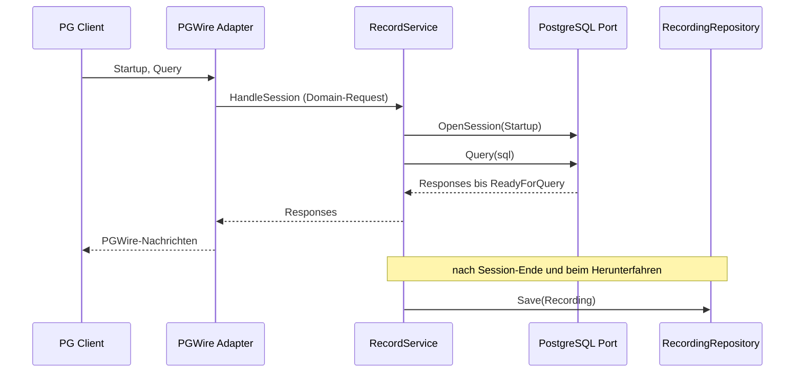
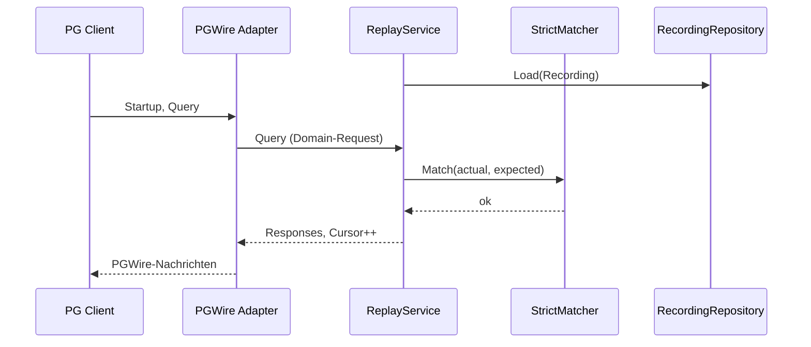
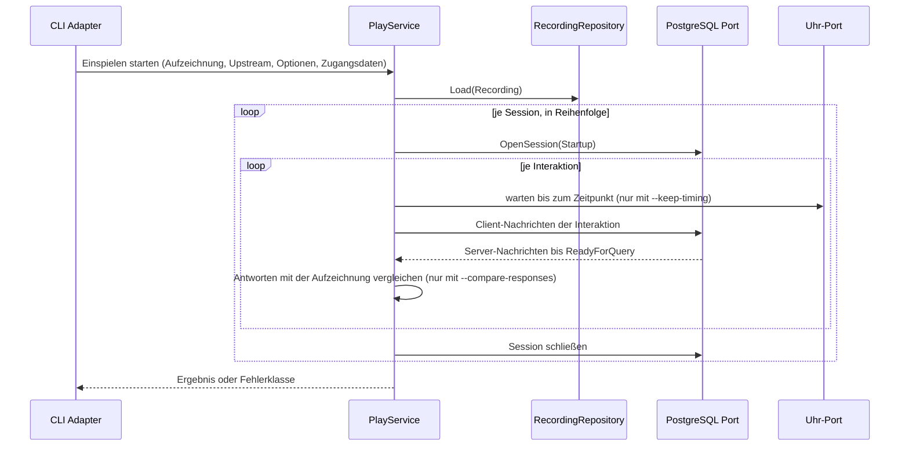
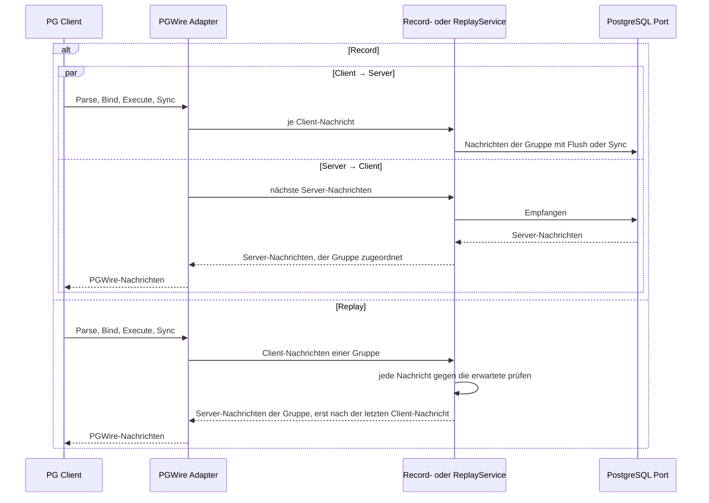
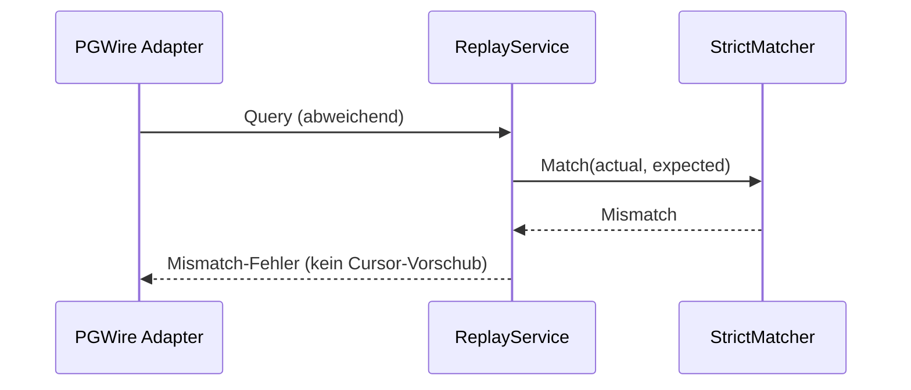
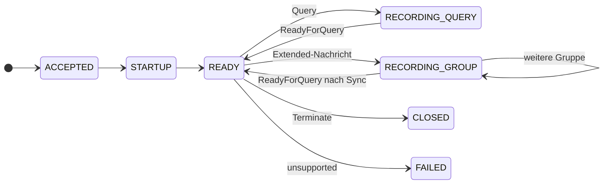
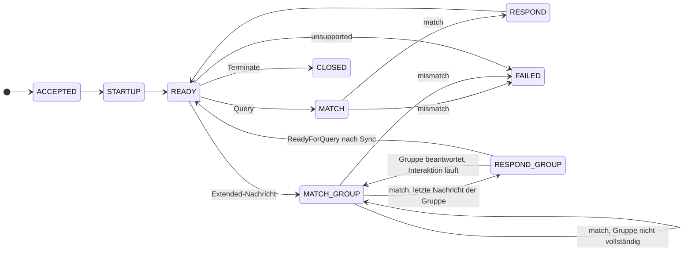

# Architektur — pgwire-recorder

**Status:** Aktiv. **Letzte Änderung:** 2026-10-05.

**Rolle:** Sicht-Stratum — *keine* eigenen Anforderungen, derivativ. Regeln:
Baseline-Regelwerk `modul-03-spec.md` §Ziel-Form: Architektur-Sicht.

**Hard Rule:** Diese Datei enthält *keine* Wellen, Slices, Commit-Hashes
oder Closure-Daten, **keine ADR-Bezüge** — die Sicht steht im
Stabilitäts-Rang über der ADR — und **keine Historie**: `Letzte Änderung`
oben ist ein Frische-Marker, kein Protokoll. Die zeitliche Schicht lebt in
`docs/plan/planning/in-progress/roadmap.md` und den späteren Closure-Notizen.
Baseline-Regelwerk `modul-03-spec.md` §Ziel-Form: Architektur-Sicht.

**Zielversion:** v1. **Architekturstil:** Hexagonale Architektur / Ports &
Adapters. **Bezug:** `spec/lastenheft.md`, `spec/spezifikation.md`.

---

## 1. Komponenten-Übersicht

Regeln dieser Sektion: **Hier werden die `ARC-*` für Komponenten vergeben** —
eine Zeile je Kasten des Diagramms, damit es *eine* Stelle gibt. Die Kennung
ist eine Adresse, damit ein Slice sagen kann, welche Komponente er
berührt; sie ist **keine** Anforderung. Gezählt wird fortlaufend je Datei —
§3 setzt die Reihe fort, statt neu zu beginnen (Baseline-Regelwerk
`grundlagen-source-precedence.md` §ID-Schema als Klammer, §Vergabe).

`pgwire-recorder` ist nach dem Prinzip der **hexagonalen Architektur (Ports &
Adapters)** aufgebaut. Die Abhängigkeitsrichtung:

```text
Driving Actor -> Driving Adapter -> Inbound Port -> Application Core
Application Core -> Outbound Port <- Driven Adapter -> Driven Actor
```

Der Application Core kennt keine konkreten Adapter. Insbesondere kennt er nicht
die PGWire-Bibliothek, TCP-Sockets, YAML-Serialisierung, das Dateisystem, CLI-Frameworks und konkrete
PostgreSQL-Verbindungen.

Die Architektur priorisiert:

1. klare Trennung zwischen Fachlogik und Infrastruktur,
2. deterministisches Record/Replay,
3. testbare Use Cases ohne Netzwerk oder Dateisystem,
4. austauschbare PGWire-, PostgreSQL- und Recording-Adapter,
5. stabile Domänentypen unabhängig von Drittbibliotheken,
6. Erweiterbarkeit für spätere PGWire-Funktionen,
7. einfache Bereitstellung als eigenständiges Binary und als Container.

`pgwire-recorder` ist ein Testwerkzeug und kein Produktions-Connection-Pooler
oder hochverfügbarer Datenbankproxy.



Pfeile zeigen die Abhängigkeit (`A --> B`: A importiert B). Driving Ports und
Driven Ports gehören zum Hexagon. `Svc` erfüllt die Driving Ports, ohne sie zu
importieren, und nutzt die Driven Ports.

| ID | Komponente | Rolle |
|---|---|---|
| `ARC-001` | Domain Model (`internal/hexagon/model`) | Kanonische Typen für Recording, Session, Interaktion, Request, Response, Extended-Gruppe, Client-Nachricht und Wert samt der Formregeln einer Interaktion; frei von Drittbibliotheken |
| `ARC-002` | Application Services (`internal/hexagon/services`) | Record-Service, Replay-Service, Play-Service und Strict Matcher; Record-/Replay-Zustandslogik und Replay-Cursor; Antwortvergleich des Play-Service |
| `ARC-003` | Driving Ports / Inbound (`internal/hexagon/ports/driving`) | Use Cases, die der Core anbietet (Record, Replay, Play) |
| `ARC-004` | Driven Ports / Outbound (`internal/hexagon/ports/driven`) | Infrastrukturleistungen, die der Core benötigt: Recording-Repository, PostgreSQL-Upstream, Uhr |
| `ARC-005` | CLI Adapter (`internal/adapters/driving/cli`) | Driving Adapter: Argumente, Umgebung und Konfigurationsdatei zu einer Konfiguration zusammenführen (einschließlich Platzhalter und Passwort), Modus wählen, Use Case starten, Fehler auf Exit Codes abbilden |
| `ARC-006` | PGWire Server Adapter (`internal/adapters/driving/pgwire`) | Driving Adapter: TCP, TLS-Terminierung auf Wunsch, PGWire-Framing, `SSLRequest`, Startup, Übersetzung von und nach Domain-Typen |
| `ARC-007` | PostgreSQL Upstream Adapter (`internal/adapters/driven/postgres`) | Driven Adapter: Verbindung zum realen PostgreSQL |
| `ARC-008` | Recording Adapter (`internal/adapters/driven/recording`) | Driven Adapter: Serialisierung (YAML oder SQLite) und Dateisystemzugriff |
| `ARC-009` | Bootstrap / Composition Root (`cmd/pgwire-recorder`, `internal/bootstrap`) | Verdrahtet konkrete Adapter mit Ports und Services |

## 2. Schichten und Constraints

Regeln dieser Sektion: Welche ADR eine Layering-Regel verbindlich macht,
deklariert die ADR aufwärts in ihrem `Schärft:`-Feld — kein ADR-Bezug in dieser
Sicht (Baseline-Regelwerk `grundlagen-referenz-richtung.md` §Referenz-Richtung (SDP)).

Eine Schicht ist eine *Gruppierung* über Komponenten, keine eigene Sache:
Fällt sie mit einer Komponente zusammen, nennt die Zeile deren `ARC-*` aus §1;
umfasst sie mehrere, bleibt die Spalte leer und die Constraint gilt für alle.

| Komponente(n) | Schicht | Verantwortlichkeit | Darf importieren | Darf NICHT importieren |
|---|---|---|---|---|
| `ARC-001` | Domain | Fachliche Typen und Invarianten, rein | — | Services, Ports, Adapter, die PGWire-Bibliothek, YAML-Serialisierungsbibliothek, Dateisystem |
| `ARC-003`, `ARC-004` | Ports | Fachlich formulierte Schnittstellen des Cores | Domain | Adapter, die PGWire-Bibliothek |
| `ARC-002` | Application | Use-Case-Logik, Matching, Zustände; erfüllt die Driving Ports | Domain, Driven Ports | Driving Ports, Adapter, die PGWire-Bibliothek, Prozessbeendigung |
| `ARC-005`, `ARC-006` | Driving Adapter | Externe Eingaben in Inbound-Port-Aufrufe übersetzen | Driving Ports, Domain | Driven Ports, Driven Adapter, andere Driving Adapter |
| `ARC-007`, `ARC-008` | Driven Adapter | Outbound Ports implementieren | Driven Ports, Domain | Driving Ports, Driving Adapter, andere Driven Adapter |
| `ARC-009` | Composition Root | Konkrete Implementierungen verdrahten | alles | — |

Zusätzliche Einschränkungen:

- die PGWire-Bibliothek ist ausschließlich in `ARC-006` und `ARC-007` zulässig; die
  YAML-Serialisierungsbibliothek ausschließlich in `ARC-008`. YAML-spezifische Annotationen oder
  Bibliothekstypen gelangen nicht in das Domain Model.
- Mapping-Funktionen zwischen Bibliothekstypen und Domain-Typen liegen in dem
  jeweiligen Adapter; kein Typ der PGWire-Bibliothek verlässt einen Adapter.
- Kein inneres Package beendet den Prozess.
- Der Core verwendet einen Abbruch-/Kontext-Mechanismus, kennt aber keine
  POSIX-Signale.
- Der Core hängt nicht von einem konkreten Logging-Framework ab.

### 2.1 Package-Struktur

```text
cmd/
└── pgwire-recorder/

internal/
├── hexagon/
│   ├── model/
│   ├── services/
│   └── ports/
│       ├── driving/
│       └── driven/
├── adapters/
│   ├── driving/
│   │   ├── cli/
│   │   └── pgwire/
│   └── driven/
│       ├── postgres/
│       └── recording/
└── bootstrap/

test/
└── integration/
```

| Package | Komponente |
|---|---|
| `internal/hexagon/model` | `ARC-001` |
| `internal/hexagon/services` | `ARC-002` |
| `internal/hexagon/ports/driving` | `ARC-003` |
| `internal/hexagon/ports/driven` | `ARC-004` |
| `internal/adapters/driving/cli` | `ARC-005` |
| `internal/adapters/driving/pgwire` | `ARC-006` |
| `internal/adapters/driven/postgres` | `ARC-007` |
| `internal/adapters/driven/recording` | `ARC-008` |
| `cmd/pgwire-recorder`, `internal/bootstrap` | `ARC-009` |

### 2.2 Dependency Inversion

Outbound Ports gehören logisch zum Application Core. Der Core definiert, **was
er benötigt**; der Driven Adapter implementiert diese Anforderung. Der Service
kennt ausschließlich den Port, nie den Adapter. Beispiel: Der Replay-Service
hält einen `RecordingRepository`-Port und kennt keine YAML- oder
Dateisystemtypen.

### 2.3 Ports

Die Zuschnitte sind konzeptionell und werden bei der Implementierung
verfeinert; die Schichtengrenze bleibt bestehen. Ports sind in fachlichen
Begriffen definiert und reichen weder rohe Connections noch Typen der
PGWire-Bibliothek durch.

**Inbound (`ARC-003`).** Der PGWire-Adapter übernimmt keine Record- oder
Replay-Fachlogik. Er führt keinen eigenen Interaktionszustand, meldet dem Use
Case die Ereignisse der Verbindung (Client-Nachricht, Verbindungsende,
`Terminate`, Schreibfehler zum Client, Herunterfahren) und führt aus, was der Use
Case zurückgibt.

| Port | Verantwortung |
|---|---|
| Record-Use-Case | Verarbeitet eine Client-Session im Record-Modus. Operationen beider Richtungen (Client → Server, Server → Client) dürfen für dieselbe Session gleichzeitig laufen; das Beenden der Session beendet jeden wartenden Aufruf mit einem Fehler |
| Replay-Use-Case | Verarbeitet eine Client-Session im Replay-Modus |
| Play-Use-Case | Führt die Anfragen einer Aufzeichnung gegen einen Server aus; wird von der CLI gestartet, nicht von einer Client-Verbindung |

Im Record-Modus übergibt der Adapter die Session als fachliche Ereignisse beider
Richtungen.

**Outbound (`ARC-004`).**

| Port | Operationen |
|---|---|
| `RecordingRepository` | Recording anhand eines Pfads laden (das Format erkennt der Adapter); Recording unter einem Pfad neu anlegen (Format, Zielpfad, Ersetzen); eine beendete Session ergänzen (nach dem Ende jeder Session und beim kontrollierten Beenden; `yaml` schreibt dabei das ganze Recording neu, `sqlite` ergänzt in einer Transaktion) |
| Uhr | aktuelle Zeit lesen und bis zu einem Zeitpunkt warten (Zeitangaben beim Aufzeichnen, zeitgetreues Einspielen); der Composition Root stellt die Systemuhr bereit, Tests eine Fake-Uhr |
| PostgreSQL-Upstream | Upstream-Session für einen Startup eröffnen; einfach: Anfrage senden und die Server-Nachrichten bis `ReadyForQuery` liefern; Extended: die Client-Nachrichten einer Gruppe senden und unabhängig davon die nächsten Server-Nachrichten liefern. Senden und Empfangen laufen gleichzeitig, jedes blockiert nur an seiner Richtung; Session schließen beendet wartendes Senden und Empfangen mit einem Fehler |

Die Query-Operation kann streaming-orientiert gestaltet werden (Antworten einzeln
abrufen, Stream schließen), um große Resultsets nicht vollständig zu puffern.
Die Ports schließen eine Streaming-Implementierung nicht aus. Keine Richtung
puffert über die laufende Gruppe hinaus; ein Ziel, das nicht liest, hält nur
seine Richtung an. Der Record-Service
reicht dann jede Antwort über den Driving Adapter an den Client weiter, ohne
eine zusätzliche Kopie des Resultsets neben der Aufzeichnung zu halten; eine
Interaktion wird mit dem abschließenden `ReadyForQuery` Teil der Session, und
eine Session wird bis zum Schreiben des Recordings im Speicher gehalten.

### 2.4 Domain Model

Das Domain Model enthält keine Typen der PGWire-Bibliothek.

| Typ | Inhalt |
|---|---|
| Recording | Formatkennung, Version, Sessions |
| Session | ID, Startup, Interaktionen |
| Interaction | Sequenz, Art (einfach oder Extended), optional Zeitabstand seit Sessionbeginn, bei einfach Request mit geordneten Responses, bei Extended geordnete Gruppen |
| Query | SQL-Text |
| Gruppe | geordnete Client-Nachrichten (`Parse`, `Bind`, `Describe`, `Execute`, `Close`, `Flush`, `Sync`) und die Server-Nachrichten, die darauf antworten |
| Value | Null-Kennzeichen und Bytes |

Antworten sind eigene Typen mit ausschließlich protokollrelevanten Daten:
`RowDescription`, `DataRow`, `CommandComplete`, `EmptyQueryResponse`,
`ErrorResponse`, `NoticeResponse`, `ParameterStatus`, `ReadyForQuery` sowie die
Antworten des Extended Query Protocol (`ParseComplete`, `BindComplete`,
`CloseComplete`, `ParameterDescription`, `NoData`, `PortalSuspended`).

Eine Interaktion ist entweder eine einfache Anfrage mit ihren Antworten oder
eine geordnete Folge von Gruppen aus Client- und Server-Nachrichten (Extended
Query). Der Matcher arbeitet auf diesen Gruppen: Er vergleicht jede eingehende
Client-Nachricht mit der erwarteten und gibt die Server-Nachrichten einer
Gruppe erst frei, wenn die letzte Client-Nachricht der Gruppe verglichen ist.

`DataRow` wird nicht als reine String-Struktur modelliert; nach Load/Save sind
die Domain-Bytes identisch. SQL ist fachlich Payload des Requests; das Modell
enthält keinen SQL-Parser.

**Recording-Invarianten.** Fachliche Invarianten werden im Core geprüft:

- Session-IDs sind eindeutig,
- Interaktionen sind geordnet,
- Sequenzen sind innerhalb einer Session eindeutig,
- jede einfache Interaktion besitzt einen gültigen Request, jede
  Extended-Interaktion mindestens eine Gruppe,
- jede Gruppe endet mit `Flush` oder `Sync`,
- eine abgeschlossene Interaktion besitzt einen gültigen Abschlusszustand
  (`ReadyForQuery`; bei Extended das `ReadyForQuery` nach dem `Sync`).

Rein serialisierungstechnische Prüfungen liegen im Recording Adapter: Syntax der
Persistenzdarstellung, Dekodierbarkeit binärer Felder, Formatkennung vorhanden,
unterstützte Dateiformatversion.

## 3. Externe Abhängigkeiten

Regeln dieser Sektion: Auch die Schnittstelle zu einem externen System trägt
eine `ARC-*` — die Kennung benennt den *Berührungspunkt*, nicht das fremde
System (Baseline-Regelwerk `grundlagen-source-precedence.md` §ID-Schema als Klammer).

| ID | System | Rolle | Substituierbarkeit |
|---|---|---|---|
| `ARC-010` | PostgreSQL | Driven Actor im Record-Modus, angebunden über `ARC-007`; im Replay-Modus nicht vorhanden | Über `ARC-004` austauschbar; Tests verwenden einen Fake |
| `ARC-011` | Dateisystem | Driven Actor für Recordings, angebunden über `ARC-008` | Über `RecordingRepository` austauschbar; Tests verwenden einen Fake |
| `ARC-012` | PGWire-Bibliothek | PGWire-Nachrichtenkodierung, nur in `ARC-006` und `ARC-007` | Auf die beiden PGWire-Adapter begrenzt |
| `ARC-013` | YAML-Serialisierungsbibliothek | Serialisierung, nur in `ARC-008` | Auf den Recording Adapter begrenzt; ein anderes Recording-Backend implementiert denselben Port |
| `ARC-014` | SQLite-Bibliothek | Speicherung im SQLite-Format, nur in `ARC-008` | Auf den Recording Adapter begrenzt; der Port `RecordingRepository` bleibt für beide Formate gleich |
| `ARC-015` | Systemuhr | Zeit lesen und warten (Zeitangaben, zeitgetreues Einspielen); der Composition Root stellt sie über den Uhr-Port bereit | Fake-Uhr in Tests |

## 4. Sequenz-Diagramme

### Use-Case: LH-FA-02 — Record-Modus



Ablauf:

1. Der Driving Adapter nimmt die Client-Session an und übersetzt den Startup in
   kanonische Daten.
2. Der Record-Service eröffnet über den Outbound Port eine Upstream-Session.
3. Eine `Query` wird als Domain-Request übergeben und über den
   PostgreSQL-Outbound-Port gesendet.
4. Antworten kommen als Domain-Responses zurück beziehungsweise werden
   gestreamt; der Service erzeugt daraus eine `Interaction`.
5. Die Responses werden über den Driving Adapter an den Client ausgegeben.
6. Bei `ReadyForQuery` gilt die Interaktion als abgeschlossen.
7. Das Recording wird über `RecordingRepository` persistiert.

### Use-Case: LH-FA-03 — Replay-Modus



Im Replay-Modus existiert kein PostgreSQL-Upstream. Der Replay-Service besitzt
den fachlichen Cursor auf die nächste erwartete Interaktion; der PGWire Adapter
kennt diesen Cursor nicht.

### Use-Case: LH-FA-20 — Einspielen



Der Play-Service nutzt nur Driven Ports (Recording-Repository,
PostgreSQL-Upstream, Uhr); ein PGWire-Server ist nicht beteiligt. Authentifizierung
und TLS gegenüber dem Server liegen im Upstream-Adapter, Optionen und Zugangsdaten
stellt die CLI aus der Konfiguration bereit. Der Play-Service wertet
`ErrorResponse` aus und vergleicht die Serverantworten nur auf Wunsch mit der
Aufzeichnung; der Vergleich ist reine Fachlogik im Core und kennt weder PGWire-Typen
noch Verbindung.

### Use-Case: LH-FA-18 — Extended Query



Im Record-Modus bildet der Core die Gruppe aus den Nachrichten zwischen zwei
Abschlüssen (`Flush` oder `Sync`); im Replay-Modus gibt er die Server-Nachrichten
einer Gruppe erst frei, wenn deren letzte Client-Nachricht verglichen ist.

### Use-Case: LH-FA-10 — Replay-Mismatch



### 4.1 Strict Matcher

Der Matcher gehört zum Application Core. v1 prüft:

```text
actual request type == expected request type
AND
actual SQL == expected SQL
AND
expected interaction == current replay position
```

Nicht durchgeführt werden SQL-Normalisierung, Whitespace-Normalisierung,
semantischer Vergleich, Regex, Fuzzy Matching und die Suche nach einer späteren
passenden Interaktion.

Für Extended Query vergleicht der Matcher jede Client-Nachricht in allen Feldern
mit der erwarteten Nachricht der aktuellen Gruppe.

Schnittstelle: Der Matcher erhält die tatsächliche Nachricht beziehungsweise
den tatsächlichen Request und die erwartete Interaktion samt Position und
liefert entweder Erfolg oder einen Mismatch-Fehler.

### 4.2 Replay-Session-State

Replay-Zustand ist Application State und gehört nicht in den PGWire Adapter. Er
besteht aus der zugeordneten Recording-Session, dem Index der nächsten
erwarteten Interaktion und, innerhalb einer Extended-Interaktion, dem Index der
nächsten erwarteten Gruppe und Nachricht.

Der Service entscheidet: Bei Match werden Responses gesendet und der Cursor
rückt vor; bei Mismatch entsteht ein Application-Fehler.

### 4.3 Zustandsautomaten

Die Interpretation der fachlichen Zustände erfolgt im Core; Netzwerkdetails
bleiben im Driving Adapter.





### 4.4 Startup, Authentifizierung und TLS

Startup ist teilweise protokollspezifisch und liegt deshalb technisch im PGWire
Driving Adapter; fachlich relevante Startup-Daten werden in Domain-Typen
übersetzt.

- **Record:** Der Record-Service nutzt den PostgreSQL-Outbound-Port, um eine
  passende Upstream-Session aufzubauen. Die konkrete PGWire-Authentifizierung
  gegenüber PostgreSQL liegt im Driven PostgreSQL Adapter.
- **Replay:** Der Driving PGWire Adapter erzeugt den für den Testclient
  erforderlichen PGWire-Handshake anhand der vom Replay Use Case gelieferten
  Sessioninformationen. Authentifizierung im Replay-Modus ist keine
  Sicherheitsgrenze.
- **`SSLRequest`:** PGWire-Infrastruktur, vom Driving Adapter behandelt. Ist TLS
  konfiguriert, nimmt der Adapter die Aushandlung an, terminiert TLS und führt den
  Verbindungsaufbau auf der verschlüsselten Verbindung aus; sonst lehnt er die
  SSL-Nutzung gemäß PGWire ab und fährt unverschlüsselt fort, sofern der Client dies
  akzeptiert. Zertifikat und Schlüssel lädt der Adapter beim Start. Der Application
  Core muss `SSLRequest` und TLS nicht kennen; die Verbindung zum Upstream im
  Record-Modus ist unverschlüsselt.

Beim Einspielen baut der Upstream-Adapter die Verbindung zum Server als Client auf:
Authentifizierung und TLS (auf Wunsch) gehören ihm; der Core kennt weder Passwort
noch Zertifikate, sondern erhält eine geöffnete Upstream-Session.

### 4.5 Adapter-Verantwortung

**PGWire Server (`ARC-006`)** ist verantwortlich für: TCP-Verbindungen
annehmen, auf Wunsch TLS terminieren, PGWire-Framing, `SSLRequest` erkennen, Startup-Nachrichten
dekodieren, Frontend-Nachrichten mit die PGWire-Bibliothek dekodieren, in
Domain-/Application-Typen übersetzen, Inbound Ports aufrufen,
Domain-Responses in PGWire-Nachrichten übersetzen und Bytes an den Client
senden. Im Record-Modus betreibt er je Session beide Richtungen als Transport.
Er ist **nicht** verantwortlich für Query-Matching,
Recording-Reihenfolge, Auswahl der nächsten Replay-Interaktion, Persistenz,
fachliche Mismatch-Entscheidungen, den Interaktionszustand, die Einstufung eines
Verbindungsendes und den Grund des Session-Endes.

**PostgreSQL Upstream (`ARC-007`)** implementiert den PostgreSQL-Outbound-Port
und verwendet die PGWire-Bibliothek beziehungsweise geeignete PGWire-Funktionalität für die
Verbindung zum realen Server. Er bildet die Domain-Query auf PGWire ab und die
Serverantworten zurück auf die Domain-Response.

**Recording (`ARC-008`)** implementiert `RecordingRepository` für zwei Formate: Beim
Speichern wird das Domain-Recording in die YAML-Darstellung überführt und im
Dateisystem abgelegt, oder (SQLite) je Session in einer Transaktion ergänzt; beim
Laden erkennt der Adapter das Format und führt in umgekehrter Richtung zurück. Das Serialisierungsschema gehört
zum Driven Adapter und breitet sich nicht in den Core aus; separate
Persistenz-DTOs im Adapter trennen Domain- und YAML-Modell, sobald beide
auseinanderlaufen. Die persistente Darstellung eines `Value` entscheidet der
Adapter, beispielsweise `text: hello`, `null: true` oder `base64: AP8Q`.

**CLI (`ARC-005`)** parst Argumente, führt sie mit Umgebung und Konfigurationsdatei
zur Konfiguration zusammen (Rang, Platzhalter und Passwort eingeschlossen), wählt den
Modus, startet den Use Case und bildet Fehler auf Exit Codes ab; ein Ladefehler der
Konfiguration ist ein Startfehler. Der Core erhält nur die fertige Konfiguration,
nie die Datei. Die CLI enthält keine Record-/Replay-Fachlogik.

### 4.6 Composition Root

Nur `ARC-009` führt konkrete Infrastrukturimplementierungen zusammen; der Core
erzeugt keine Adapter selbst. Für Replay: Recording-Repository und Strict Matcher erzeugen, daraus den
Replay-Service bauen, den PGWire-Server mit dem Service verdrahten und als
Anwendung zurückgeben. Record verdrahtet analog den Record-Service mit
Recording-Repository und PostgreSQL-Upstream-Adapter. Die Verdrahtung ist
konzeptionell, keine verbindliche API.

## 5. Fehlermodelle und Resilienz

| Fehlerquelle | Behandlung-Schicht | Logging |
|---|---|---|
| Fachliche Fehler (`Mismatch`, `UnsupportedInteraction`, `RecordingExhausted`, `InvalidRecording`) | im Core definiert beziehungsweise klassifiziert (`ARC-002`) | Fehlerkategorie, Session-ID, Interaction Sequence |
| Infrastrukturfehler (`ConnectionRefused`, `FileNotFound`, `PermissionDenied`, `MalformedYAML`) | entstehen in den Driven Adaptern (`ARC-007`, `ARC-008`) und werden in für den Port geeignete Fehler übersetzt | Fehlerkategorie, Remote-Adresse im Adapterkontext |
| Abbildung auf Exit Codes | äußerster Rand: CLI (`ARC-005`) | Fehlertext nach `stderr` |
| Verbindungsfehler (Mismatch, nicht unterstützte Interaktion, Upstream-Fehler, unerwartetes Verbindungsende) | beenden die Application Session; der Driving Adapter beendet die Verbindung, der Prozess läuft weiter und der Rand merkt sich die Klasse des ersten Fehlers | Fehlerkategorie, Session-ID, Interaction Sequence |
| OS-Signale | CLI / Bootstrap (`ARC-005`, `ARC-009`) lösen den Abbruch über den Kontext-Mechanismus aus | Modus |

**Graceful Shutdown.** Signalbehandlung gehört zum äußersten Anwendungsrand:
CLI/Bootstrap lösen einen Abbruch über den Kontext-Mechanismus aus, die den Driving Server
stoppt, die Application Sessions beendet und die Repositories abschließt. Ob eine
Session auf ihre laufende Interaktion wartet und ob eine Client-Nachricht noch
eine Interaktion beginnt, entscheidet der Service; das Beenden einer Session
beendet jeden wartenden Port-Aufruf, und der Driving Adapter schließt die
Client-Verbindung.

**Concurrency.** Der PGWire Driving Adapter darf jede Client-Verbindung
nebenläufig verarbeiten; die Parallelitätsmechanik ist Infrastruktur. Fachlicher
Session-State bleibt je Verbindung getrennt (Verbindung *n* → Application
Session *n*). Im Record-Modus laufen je Session beide Richtungen nebenläufig; der
Record-Service ordnet ihre Aufrufe je Session, ohne über einem blockierenden
Upstream-Aufruf zu sperren; das Schreiben der Aufzeichnung beim Session-Ende ist
sitzungsübergreifend serialisiert, und während es läuft, wartet jeder Aufruf
jeder Session. Gemeinsamer Recording-State wird über einen dafür vorgesehenen
Application Service beziehungsweise eine synchronisierte Implementierung
koordiniert. Im Replay erhält die n-te Verbindung die n-te aufgezeichnete
Session; deterministisch ist das bei nacheinander aufgebauten Verbindungen.

**Observability.** Logging wird an den Rändern injiziert beziehungsweise über
eine kleine Abstraktion bereitgestellt. Logs können Modus, Session-ID,
Interaction Sequence, Fehlerkategorie und die Remote-Adresse im Adapterkontext
enthalten.

## 6. Qualitätssicherung der Architektur

**Tests nach Hexagon.**

- *Domain-Tests:* keine Adapter, kein Netzwerk, kein Dateisystem; Interaktions-
  invarianten, Values, Recording-Zustände.
- *Application-Tests:* Inbound Ports werden direkt aufgerufen, Outbound Ports
  durch Fakes ersetzt (`FakeRecordingRepository`, `FakePostgreSQL`). Record und
  Replay sind damit ohne PostgreSQL und ohne YAML testbar.
- *Adapter-Contract-Tests:* Driven Adapter gegen ihre Ports (YAML-Roundtrip,
  PostgreSQL Adapter gegen eine reale Testinstanz); Driving Adapter: PGWire
  Bytes → Domain Request, Domain Response → korrekte PGWire Bytes, `SSLRequest`,
  Startup.
- *End-to-End:* PostgreSQL starten, Record-Modus mit echtem PG-Client,
  Recording, PostgreSQL stoppen, Replay-Modus mit demselben Client.

**Architektur-Gate.** Die Abhängigkeitsregeln aus §2 sind die Vorgabe für das Architektur-Gate
(**a-check**); die Konfiguration liegt in der Repository-Wurzel
(`.a-check.yml`). Rollen und
Richtungen:

```text
model            role=domain
services         role=app
ports/driving    role=port     direction=inbound
ports/driven     role=port     direction=outbound
adapters/driving role=adapter  direction=driving
adapters/driven  role=adapter  direction=driven
```

Erlaubt sind ausschließlich diese Kanten: Application → Domain und Driven
Ports; Driving Ports → Domain; Driven Ports → Domain; Driving Adapter → Driving
Ports und Domain; Driven Adapter → Driven Ports und Domain. Geprüft werden
damit unter anderem Domain-, Application- und Port-Reinheit, keine lateralen
Adapter-Abhängigkeiten, korrekte Schichtrichtung, dass die PGWire-Bibliothek in den
PGWire-/PostgreSQL-Adaptern und YAML im Recording-Adapter bleibt. Die Composition Root ist von den Schichtregeln ausgenommen:

```text
cmd/**
internal/bootstrap/**
```

Eine Verletzung dieser Grenzen ist ein Befund des Gates.

## 7. Erweiterungspunkte

- **Anderes Recording-Backend:** Ein alternatives Backend implementiert
  denselben Outbound Port (`RecordingRepository`); der Replay-Service bleibt
  unverändert.
- **Anderer Driving Adapter:** Weitere Eingänge (zum Beispiel eine HTTP-API)
  rufen dieselben Inbound Ports auf, ohne die Fachlogik zu duplizieren. Sie sind
  nicht Bestandteil von v1.

## 8. Hauptrisiken

| Risiko | Maßnahme |
|---|---|
| PGWire-Details sickern in den Core | Import-Regeln im Architektur-Gate, die die PGWire-Bibliothek außerhalb der beiden PGWire-Adapter verbieten |
| YAML wird zum Domain Model | Separate Persistenz-DTOs im Recording Adapter, sobald Domain- und YAML-Modell auseinanderlaufen |
| Zu breite Port-Interfaces (Durchreichen roher Connections oder Typ der PGWire-Bibliotheken wäre nur scheinbar hexagonal) | Ports in fachlichen Begriffen definieren und bewusst klein halten |
